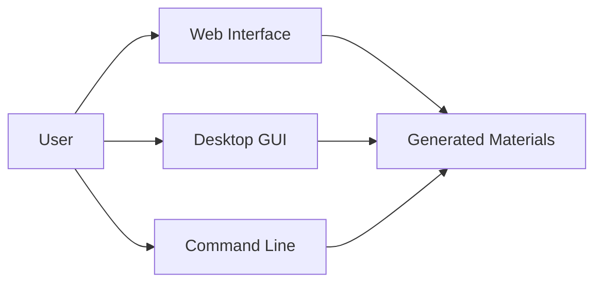

# 📚 Medical Study Prompt Generator

<div align="center">


**Transform medical exam PDFs into AI-enriched study materials**

[Features](#-features) • [Quick Start](#-quick-start) • [Documentation](#-documentation) • [Examples](#-examples)

</div>

---

## 🎯 Overview

A comprehensive suite of tools for medical students to create professional study materials from NBME/USMLE practice exams. Powered by GPT-4 and enriched with First Aid content.

### 🌟 What You Get

<table>
<tr>
<td width="50%">

**🤖 AI Study Prompt Generator**
- Extracts questions from exam PDFs
- AI-powered concept identification
- First Aid integration
- Generates comprehensive study prompts
- CSV export for easy use

</td>
<td width="50%">

**📄 Professional PDF Creator**
- Images to PDF conversion
- 2 images per page layout
- Custom branding & titles
- Professional formatting
- Perfect for printing

</td>
</tr>
</table>

### 🎨 Multiple Interfaces



- **🌐 Web Interface** - Beautiful browser-based UI with real-time updates
- **🖥️ Desktop GUI** - Native application with tkinter
- **⌨️ Command Line** - For automation and scripts

---

## ✨ Features

### Study Prompt Generator

| Feature | Description |
|---------|-------------|
| **📄 PDF Extraction** | Automatically parses NBME/USMLE exam PDFs |
| **🤖 AI Analysis** | GPT-4 identifies key medical concepts |
| **📚 First Aid Integration** | Enriches prompts with textbook content |
| **📊 CSV Export** | Clean, organized output format |
| **⚡ Real-time Progress** | Live updates during generation |
| **🔐 Secure** | API keys stored locally, never shared |

### PDF Generator

| Feature | Description |
|---------|-------------|
| **🖼️ Image Processing** | Handles all common image formats |
| **📐 Smart Layout** | 2 images per page, optimally sized |
| **🎨 Professional Design** | Beautiful title page and headers |
| **📝 Custom Text** | Add your own titles and descriptions |
| **🔢 Auto-numbering** | Automatically sorts and numbers images |
| **📏 Multiple Sizes** | Letter or A4 paper sizes |

---

## 🚀 Quick Start

### Installation

```bash
# Clone the repository
git clone https://github.com/blakeyoung81/CSV-Image-Prompt-Generator.git
cd CSV-Image-Prompt-Generator

# Install dependencies
pip3 install -r requirements.txt
```

### Configuration

1. **Get OpenAI API Key**
   - Visit [platform.openai.com/api-keys](https://platform.openai.com/api-keys)
   - Create a new API key

2. **Configure (Optional)**
   ```bash
   echo 'OPENAI_API_KEY=sk-your-key-here' > .env
   ```
   *Note: Web and GUI interfaces will prompt for key if not configured*

3. **Add First Aid PDF**
   - Place `firstaid.pdf` in the project directory
   - Any edition works (latest recommended)

---

## 🎨 Usage

### 🌐 Web Interface (Recommended)

<div align="center">

**Beautiful, Modern, Real-Time**

</div>

```bash
python3 web_app.py
```

Then open your browser to `http://localhost:5000`

**Features:**
- 🎨 Modern purple gradient design
- 📝 Pre-filled intelligent defaults
- 🔑 Easy API key setup
- 📊 Real-time progress bar
- 📟 Live console output
- 💾 One-click download

---

### 🖥️ Desktop GUI

<div align="center">

**Native Application Experience**

</div>

#### Study Prompt Generator
```bash
python3 gui_app.py
```

#### PDF Generator
```bash
python3 pdf_generator_gui.py
```

**Features:**
- 📁 File browser integration
- 🎯 Auto-detection of PDFs
- 📊 Progress tracking
- ✨ Professional interface

---

### ⌨️ Command Line

<div align="center">

**Fast & Scriptable**

</div>

#### Generate Study Prompts

```bash
# Basic usage
python3 generate_study_prompts.py "NBME_30.pdf"

# Custom output
python3 generate_study_prompts.py "NBME_30.pdf" "my_prompts.csv"

# Interactive mode
python3 run.py
```

#### Generate PDF from Images

```bash
# Basic usage
python3 generate_pdf_from_images.py images_folder/

# With custom title
python3 generate_pdf_from_images.py images_folder/ -t "NBME 30"

# Full customization
python3 generate_pdf_from_images.py images_folder/ \
    -o "NBME_30.pdf" \
    -t "NBME 30 Form A" \
    -a "Self-Assessment Practice"
```

---

## 📊 Output Examples

### Study Prompt CSV

```csv
Question Number,Prompt
1,"Professionally condense and explain the material relevant to how allosteric activators, such as AMP, influence enzyme kinetics (specifically Km and Vmax) in the context of skeletal muscle glycogen phosphorylase, including the biochemical definition of Km as substrate concentration at half-maximal velocity..."
2,"Professionally condense and explain the clinical presentation, laboratory findings (pancytopenia with thrombocytopenia, anemia, and leukocytosis with >20% blasts on peripheral smear), and unique physical markers like gingival hypertrophy associated with Acute Myelogenous Leukemia..."
```

### Professional PDF Layout

```
┌──────────────────────────────────────┐
│  NBME 30                Page 2 of 26 │
│──────────────────────────────────────│
│                                      │
│     [Question 1 Image]               │
│          Question 1                  │
│                                      │
│──────────────────────────────────────│
│                                      │
│     [Question 2 Image]               │
│          Question 2                  │
│                                      │
│──────────────────────────────────────│
│                  2                   │
└──────────────────────────────────────┘
```

---

## 📈 Performance

| Metric | Value |
|--------|-------|
| **Processing Speed** | ~6-12 seconds per question |
| **50-Question Exam** | 5-10 minutes total |
| **API Cost** | ~$0.40-0.60 per exam (GPT-4) |
| **PDF Generation** | Instant for up to 100 images |

---

## 🛠️ Technical Stack

<div align="center">

| Component | Technology |
|-----------|-----------|
| **Backend** | Python 3.8+ |
| **AI** | OpenAI GPT-4 |
| **Web Framework** | Flask + SSE |
| **GUI** | tkinter |
| **PDF Processing** | PyPDF2 |
| **PDF Generation** | ReportLab |
| **Image Processing** | Pillow |

</div>

---

## 📖 Documentation

<div align="center">

| Document | Description |
|----------|-------------|
| [START_HERE.md](START_HERE.md) | Quick start guide |
| [QUICKSTART.md](QUICKSTART.md) | 3-minute setup |
| [GUI_GUIDE.md](GUI_GUIDE.md) | Desktop GUI manual |
| [PDF_GENERATOR_GUIDE.md](PDF_GENERATOR_GUIDE.md) | PDF generator guide |
| [USAGE_EXAMPLES.md](USAGE_EXAMPLES.md) | Examples & troubleshooting |
| [WORKFLOW.md](WORKFLOW.md) | Process flow diagrams |
| [PROJECT_SUMMARY.md](PROJECT_SUMMARY.md) | Technical deep-dive |

</div>

---

## 🎓 Use Cases

### 1. USMLE/NBME Preparation
- Process practice exams
- Create comprehensive study guides
- Generate review prompts
- Organize by topic/system

### 2. Medical School Exams
- Review past exams
- Create flashcards
- Build study materials
- Share with study groups

### 3. Question Banks
- Compile custom question sets
- Professional PDF creation
- Easy annotation
- Print-friendly format

### 4. Research & Teaching
- Create teaching materials
- Organize medical images
- Professional presentations
- Educational resources

---

## 🔒 Security & Privacy

| Aspect | Details |
|--------|---------|
| **API Keys** | Stored locally in `.env`, never transmitted |
| **Data Processing** | All processing done locally |
| **PDF Files** | Never uploaded to external servers |
| **Git Ignore** | Sensitive files automatically excluded |
| **Open Source** | Code is transparent and auditable |

---

## 🤝 Contributing

We welcome contributions! Here's how:

1. **Fork** the repository
2. **Create** a feature branch (`git checkout -b feature/AmazingFeature`)
3. **Commit** your changes (`git commit -m 'Add AmazingFeature'`)
4. **Push** to the branch (`git push origin feature/AmazingFeature`)
5. **Open** a Pull Request

---

## 🐛 Troubleshooting

### Common Issues

<details>
<summary><b>API Key Not Found</b></summary>

**Solution:** Create `.env` file with your OpenAI API key
```bash
echo 'OPENAI_API_KEY=sk-your-key' > .env
```
</details>

<details>
<summary><b>No Questions Extracted</b></summary>

**Causes:**
- PDF has no extractable text
- Needs OCR processing

**Solution:** Use OCR software on your PDF first
</details>

<details>
<summary><b>Images Not Found in PDF Generator</b></summary>

**Solution:** Ensure images are numbered (1.png, 2.jpg, etc.)
</details>

<details>
<summary><b>Web Interface Won't Start</b></summary>

**Solution:** Check if port 5000 is available
```bash
lsof -ti:5000 | xargs kill -9  # Kill existing process
python3 web_app.py
```
</details>

---

## 📊 Project Stats

<div align="center">


</div>

---

## 🎯 Roadmap

- [ ] **Multi-language support** - Spanish, Mandarin, etc.
- [ ] **Cloud deployment** - AWS/Heroku hosting
- [ ] **Mobile app** - iOS/Android native apps
- [ ] **Batch processing** - Process multiple exams at once
- [ ] **Export formats** - Anki, Notion, PDF with prompts
- [ ] **OCR integration** - Built-in PDF text extraction
- [ ] **Question tagging** - Automatic topic categorization
- [ ] **Analytics** - Track study progress

---

## 📜 License

This project is licensed under the MIT License - see the [LICENSE](LICENSE) file for details.

---

## 🙏 Acknowledgments

- **OpenAI** - For GPT-4 API
- **First Aid** - Medical reference content
- **NBME/USMLE** - Practice exam format
- **Medical Student Community** - Feedback and testing

---

## 📞 Support

<div align="center">

**Need Help?**

[📖 Read the Docs](INDEX.md) • [🐛 Report Bug](https://github.com/blakeyoung81/CSV-Image-Prompt-Generator/issues) • [💡 Request Feature](https://github.com/blakeyoung81/CSV-Image-Prompt-Generator/issues)

---

**Made with ❤️ for medical students**

⭐ Star this repo if you find it helpful!

</div>

---

<div align="center">

### 🚀 Get Started Now

```bash
git clone https://github.com/blakeyoung81/CSV-Image-Prompt-Generator.git
cd CSV-Image-Prompt-Generator
pip3 install -r requirements.txt
python3 web_app.py
```

**Happy Studying! 📚✨**

</div>
